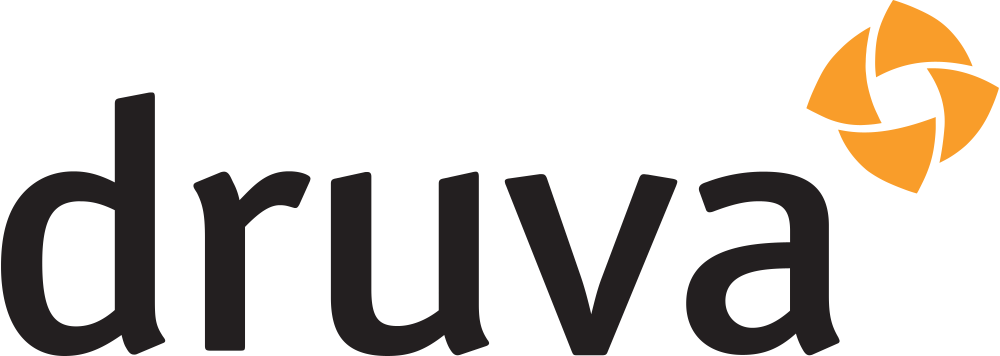

# 
hello, world!  🙋‍♂️ 

### 
it's salil

student ✨ engineer ✨ writer ✨ (software) product builder ✨ film-maker 

### what do i do, professionally? 👨‍💼

i'm a technical writer by day. a software engineer by night. otherwise, wholeheartedly a student. 🧑‍🎓

### what i'm working on these days? 🖥️

right now, at Blueshift . as a senior technical writer, writing their product and developer documentation. 📝
 would like to check 'em out? here you go:

- [product documentation](https://help.blueshift.com/hc/en-us)
- [developer documentation](https://developer.blueshift.com)

### what was i working on, previously? 📅

earlier, i was a technical writer at these companies:

- Druva&nbsp;&nbsp;&nbsp;&nbsp;&nbsp;&nbsp;&nbsp;&nbsp; 
- Adobe&nbsp;&nbsp;&nbsp;&nbsp;&nbsp;&nbsp;&nbsp;&nbsp; 
- Symantec&nbsp;&nbsp; 

before that, a manual tester at:

- HCL&nbsp;&nbsp;&nbsp;&nbsp;&nbsp;&nbsp;&nbsp;&nbsp;&nbsp;&nbsp;

### what's up with my github? 

well, currently, bit by the bug of coding again. if you look closely, this is what i've been doing:

- learning go: 
- learning elixir: 

### and what's next? :sunny:

next is, well... nextjs  :rofl:. but yeah, one of the frontend frameworks, and then, maybe flutter for mobile development. :blush:
